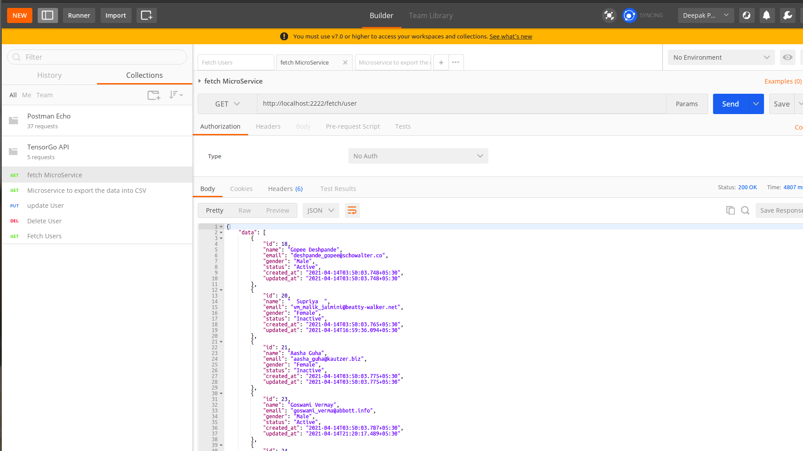
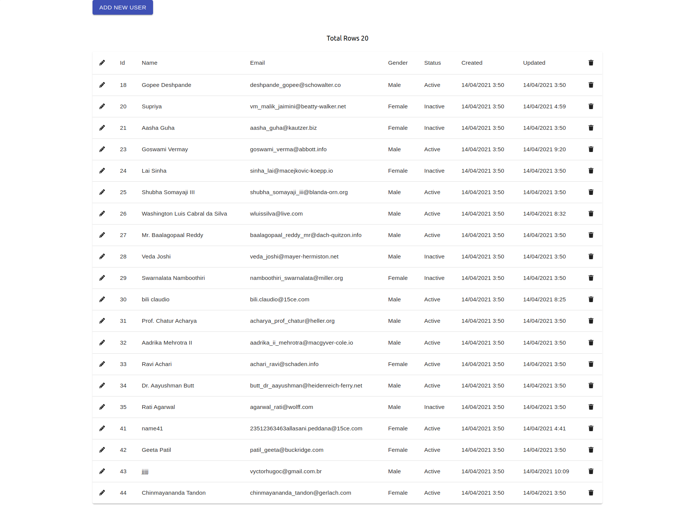
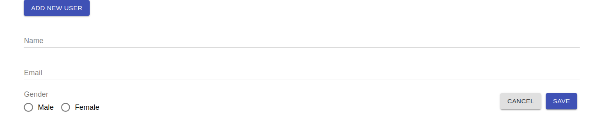
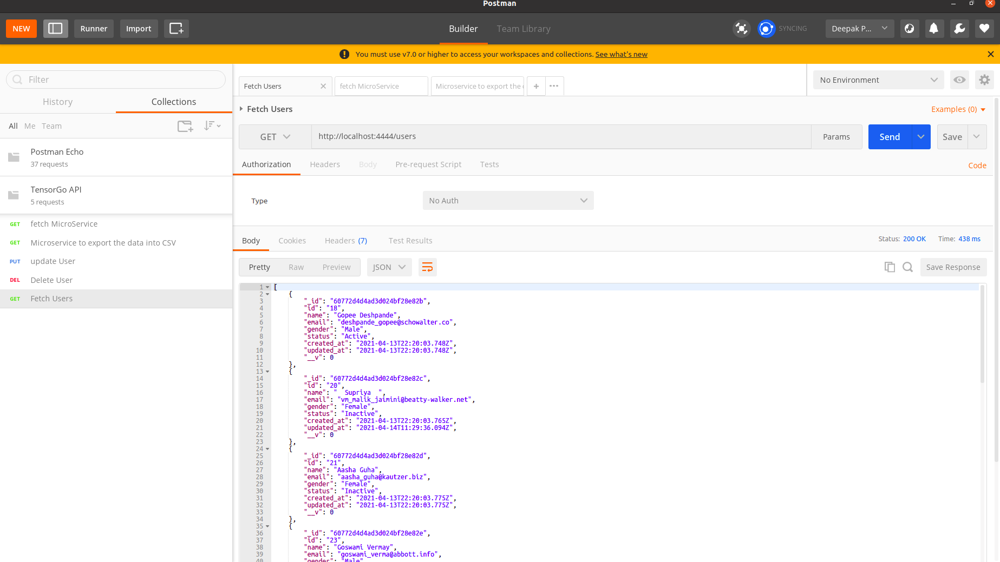
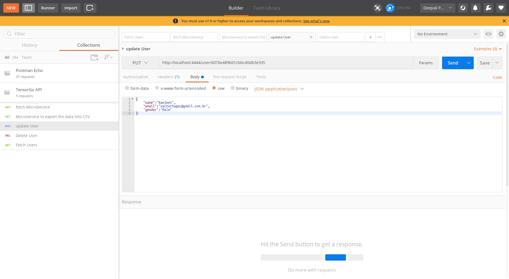
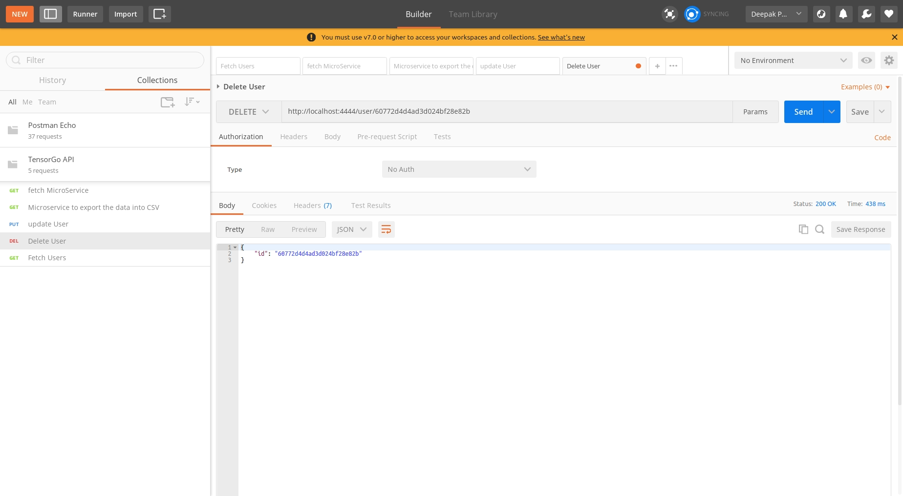
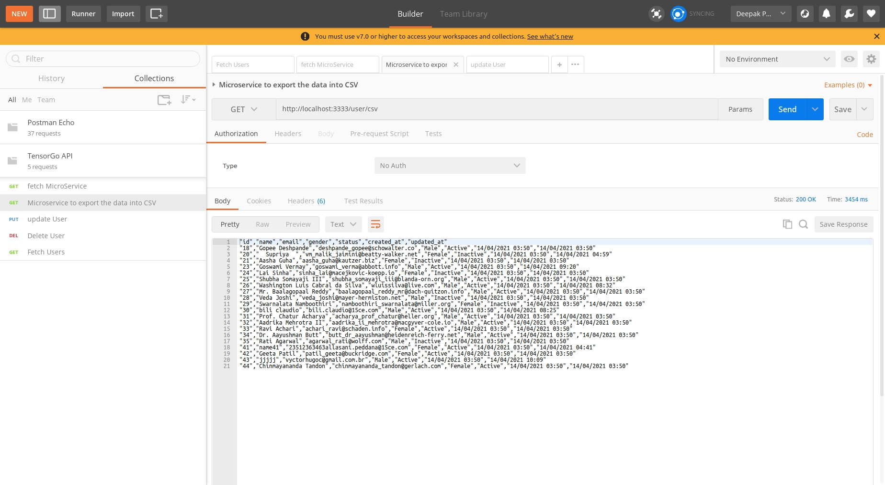

# TensorGo Assignment

# MicroServices to fetch the API and store the data in the Database
### Fetch data from external API http://localhost:2222/fetch/user

# Publish the User data to the frontend and update the data in the table

## UI ScreenShorts
* List of Users

* ADD Edit User

## API References

### Fetch Users http://localhost:4444/users
    Method GET

### Update User http://localhost:4444/user/6076e489b01cbbcd0d63e335
    Method PUT
    BODY
    {
        "name":"Ranjeet",
        "email":"vyctorhugoc@gmail.com.br",
        "gender":"Male"
    }

### Delete User http://localhost:4444/user/6076e489b01cbbcd0d63e335
    Method DELETE
    Params{
        id:6076e489b01cbbcd0d63e335
    }

## Microservice to export the data into CSV

### http://localhost:3333/user/csv
    Method GET

